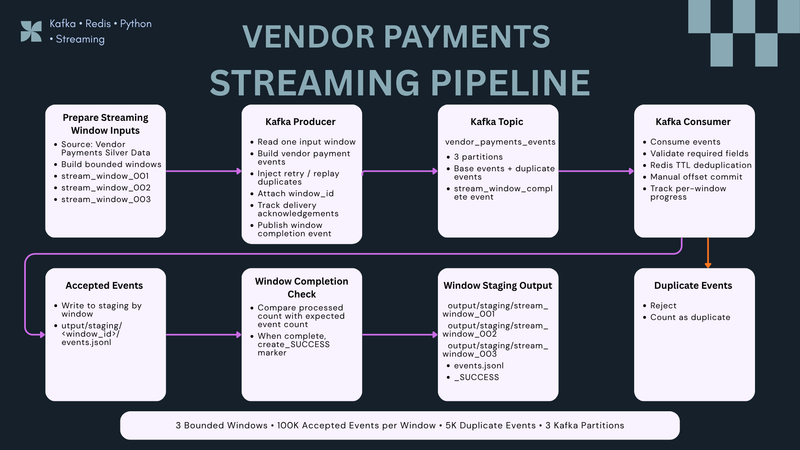
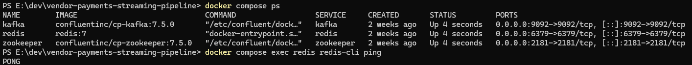
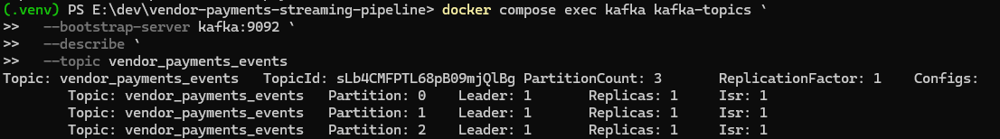
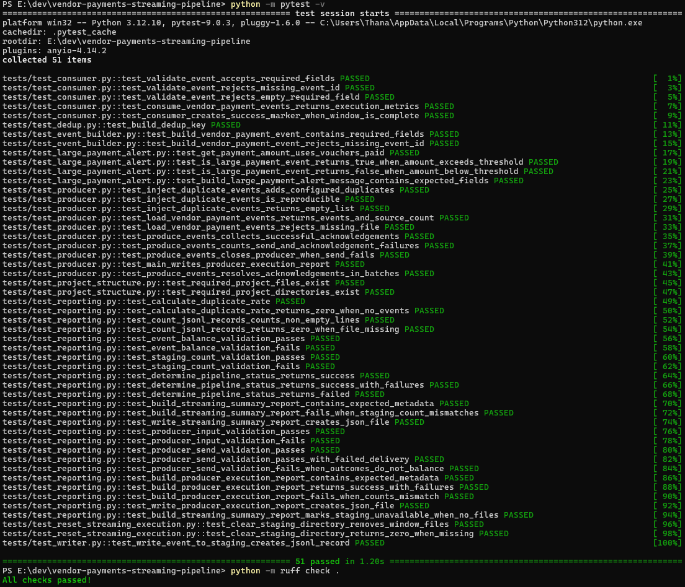
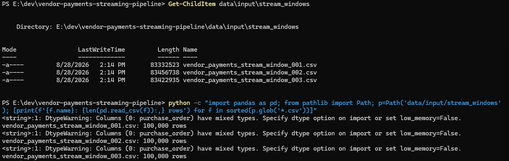
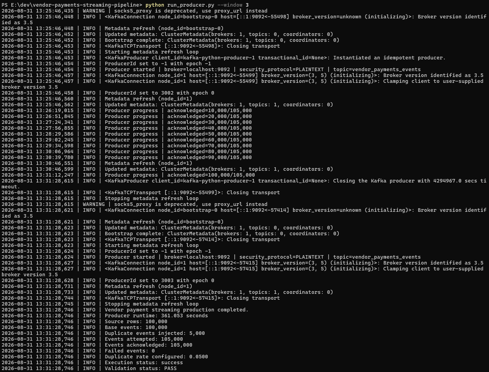
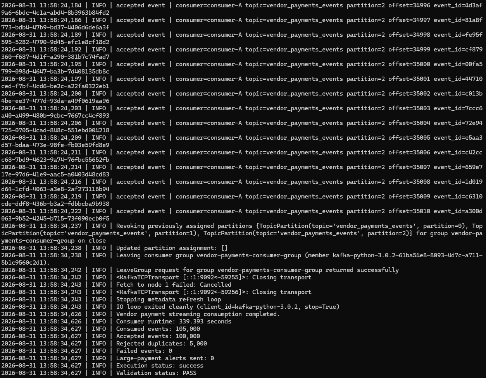
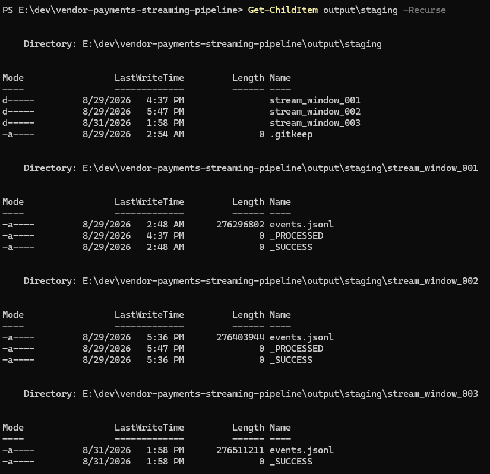
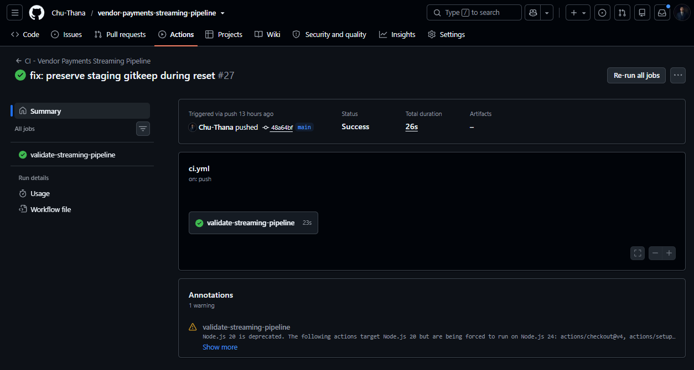

# ⚡ Vendor Payments Kafka Streaming Pipeline


Production-style Kafka streaming ingestion pipeline for converting cleaned Vendor Payments records into bounded event windows, simulating retry and replay duplicates, applying Redis-based deduplication, writing accepted events to per-window staging, and publishing explicit completion markers for downstream orchestration.

This repository is the streaming ingestion layer of the **Vendor Payments Data Engineering Portfolio**.

---

## 📌 Project Summary

The current version moves away from one fixed streaming staging file and uses three deterministic bounded windows:

```text
stream_window_001
stream_window_002
stream_window_003
```

Each window contains 100,000 source records.

During a clean validation run, the producer adds 5,000 deterministic retry/replay duplicates, giving a 105,000-message Kafka workload per window.

The consumer validates events, rejects duplicate `event_id` values with Redis, writes 100,000 accepted events to per-window staging, and creates `_SUCCESS` when the window is complete.

Key capabilities:

* Trusted Silver data as the streaming source
* Three bounded input windows
* Structured Kafka events with `window_id`
* Deterministic retry/replay duplicate injection
* Kafka producer delivery acknowledgement tracking
* 3-partition Kafka topic
* Redis TTL deduplication
* Manual Kafka offset commits
* Per-window JSONL staging
* Explicit `_SUCCESS` completion markers
* Producer and consumer runtime metadata
* Validation of event and staging balances
* Docker Compose local infrastructure
* 51 automated tests
* Ruff linting
* GitHub Actions CI

The main reliability principle is:

```text
Prevent data loss first, then handle duplicates safely.
```

---

## 🧭 Architecture



```text
Vendor Payments Silver Data
→ Prepare Bounded Streaming Windows
→ Kafka Producer
→ Kafka Topic
→ Kafka Consumer
→ Redis Deduplication
→ Per-Window Staging
→ Window Completion Check
→ _SUCCESS
→ Airflow Downstream Processing
```

### Layer Responsibilities

* **Streaming Window Preparation** — Builds deterministic bounded inputs from trusted Silver data.
* **Kafka Producer** — Reads one window, builds events, injects retry/replay duplicates, attaches `window_id`, tracks acknowledgements, and publishes a completion control event.
* **Kafka Topic** — Routes `vendor_payments_events` across 3 partitions.
* **Kafka Consumer** — Validates events, performs Redis deduplication, writes accepted events by window, tracks progress, and commits offsets manually.
* **Window Completion Check** — Verifies that the expected number of events for the current window has been processed.
* **`_SUCCESS` Marker** — Signals that consumer ingestion for a window is complete.
* **Airflow Downstream Processing** — Discovers `_SUCCESS` windows and later creates `_PROCESSED` after downstream processing completes.

---

## 📊 Project Metrics

Latest clean local validation run for `stream_window_003`:

| Metric | Value |
| --- | ---: |
| Bounded windows prepared | 3 |
| Source records per window | 100,000 |
| Base events per window | 100,000 |
| Duplicate events injected | 5,000 |
| Kafka events attempted | 105,000 |
| Kafka events acknowledged | 105,000 |
| Kafka events consumed | 105,000 |
| Unique events accepted | 100,000 |
| Redis duplicates rejected | 5,000 |
| Producer failed events | 0 |
| Consumer failed events | 0 |
| Staging records produced | 100,000 |
| Observed duplicate rate | 4.76% |
| Producer runtime | 361.053 seconds |
| Consumer runtime | 339.393 seconds |
| Kafka partitions | 3 |
| Replication factor | 1 |
| Automated tests passed | 51 |
| Ruff linting | PASS |
| Producer validation | PASS |
| Consumer validation | PASS |

These figures are from a **local simulated workload** for portfolio validation, not production traffic or a production benchmark.

---

## 🖥️ Streaming Infrastructure

Kafka, Redis, and Zookeeper run locally through Docker Compose.

```powershell
docker compose up -d
docker compose ps
docker compose exec redis redis-cli ping
```

Expected Redis result:

```text
PONG
```



---

## 📨 Kafka Topic

Topic configuration:

```text
Topic: vendor_payments_events
Partition count: 3
Replication factor: 1
```

The current validation uses one consumer process, which can be assigned all three partitions.

```text
Partition 0 ─┐
Partition 1 ─┼─> consumer-A
Partition 2 ─┘
```



---

## 🧪 Automated Testing and Code Quality

The project currently passes:

```text
51 tests passed
All checks passed!
```

Run locally:

```powershell
python -m pytest -v
python -m ruff check .
```

The tests cover consumer validation, execution metrics, window-aware staging, `_SUCCESS` creation, Redis deduplication, event construction, duplicate injection, producer acknowledgements, execution metadata, event-balance validation, staging-count validation, reset behavior, project structure, and JSONL output.



---

## 🪟 Bounded Streaming Windows

Input preparation creates three deterministic 100,000-row files:

```text
data/input/stream_windows/
├── vendor_payments_stream_window_001.csv
├── vendor_payments_stream_window_002.csv
└── vendor_payments_stream_window_003.csv
```

This design gives downstream systems explicit, independently trackable work units instead of relying on one fixed staging file.



---

## 📤 Kafka Producer

The producer reads one bounded input window and builds structured Vendor Payments events.

Processing flow:

```text
Read one input window
→ Build 100,000 base events
→ Inject 5,000 deterministic duplicates
→ Attach window_id
→ Publish 105,000 events
→ Track delivery acknowledgements
→ Publish stream_window_complete event
→ Generate producer execution metadata
```

Message key priority:

```text
business_composite_key
→ source_row_hash
→ event_id
```

Latest clean execution:

```text
Source rows: 100,000
Base events: 100,000
Duplicate events injected: 5,000
Events attempted: 105,000
Events acknowledged: 105,000
Failed events: 0
Execution status: success
Validation status: PASS
```



---

## 📥 Kafka Consumer

The consumer validates each message, applies Redis event-ID deduplication, writes accepted events into the current window staging directory, and commits Kafka offsets manually.

Processing flow:

```text
Poll Kafka
→ Validate required fields
→ Read window_id
→ Check event_id in Redis
→ Reject duplicate or accept event
→ Write accepted event to per-window staging
→ Track window progress
→ Commit Kafka offset
→ Evaluate completion
→ Create _SUCCESS
```

Automatic offset commits are disabled:

```python
enable_auto_commit = False
```

Latest clean execution:

```text
Consumed events: 105,000
Accepted events: 100,000
Rejected duplicates: 5,000
Failed events: 0
Execution status: success
Validation status: PASS
```



---

## ♻️ Deduplication Strategy

Redis provides the first-level streaming deduplication layer.

Key format:

```text
event:{event_id}
```

Processing behavior:

```text
New event_id
→ write accepted event
→ store event_id in Redis with TTL
→ commit Kafka offset

Existing event_id
→ reject as duplicate
→ count duplicate
→ commit Kafka offset
```

Latest clean result:

```text
Accepted unique events: 100,000
Rejected duplicate events: 5,000
Observed duplicate rate: 4.76%
```

The downstream Airflow pipeline performs separate downstream validation and processing after the streaming window is complete.

---

## 🗃️ Window Completion and Staging Output

Accepted events are stored by window:

```text
output/staging/
├── stream_window_001/
│   ├── events.jsonl
│   ├── _SUCCESS
│   └── _PROCESSED
├── stream_window_002/
│   ├── events.jsonl
│   ├── _SUCCESS
│   └── _PROCESSED
└── stream_window_003/
    ├── events.jsonl
    └── _SUCCESS
```

Marker responsibilities are intentionally separate:

```text
_SUCCESS
= Kafka consumer ingestion is complete

_PROCESSED
= downstream Airflow processing is complete
```

This prevents Airflow from consuming an incomplete window and makes the boundary between ingestion and downstream processing explicit.



---

## ✅ Runtime Validation

### Producer

```text
Source row count
=
Base event count
```

and:

```text
Events attempted
=
Events acknowledged
+ Failed events
```

Latest result:

```text
100,000 = 100,000
105,000 = 105,000 + 0
Validation: PASS
```

### Consumer

```text
Events consumed
=
Accepted events
+ Rejected duplicates
+ Failed events
```

Latest result:

```text
105,000
=
100,000
+ 5,000
+ 0
```

Staging validation:

```text
Accepted events
=
Current window staging record count
```

Latest result:

```text
100,000 = 100,000
Validation: PASS
```

Producer and consumer also write machine-readable execution reports:

```text
output/reports/producer_execution_summary.json
output/reports/consumer_execution_summary.json
```

---

## ⚙️ Continuous Integration

GitHub Actions runs validation on pushes and pull requests.

The current `main` branch CI workflow completes successfully.



---

## 🚨 Optional Telegram Alerting

The project can optionally send Telegram alerts for high-value payments.

Standard validation evidence keeps alerting disabled:

```env
ENABLE_TELEGRAM_ALERTS=false
```

Telegram alerting is intentionally treated as an optional operational feature rather than part of the core bounded-window evidence.

Do not commit real Telegram credentials.

---

## 🗂️ Project Structure

```text
vendor-payments-streaming-pipeline/
│
├── assets/
│   └── vendor-payments-streaming/
│       ├── 00_streaming_architecture.png
│       ├── 01_streaming_infrastructure.png
│       ├── 02_streaming_kafka_topic.png
│       ├── 03_streaming_tests_and_lint.png
│       ├── 04_streaming_windows.png
│       ├── 05_producer_execution.png
│       ├── 06_consumer_execution.png
│       ├── 07_window_completion.png
│       └── 08_streaming_ci_success.png
│
├── common/
├── consumer/
│   └── consumer.py
├── data/
│   └── input/
│       └── stream_windows/
│           ├── vendor_payments_stream_window_001.csv
│           ├── vendor_payments_stream_window_002.csv
│           └── vendor_payments_stream_window_003.csv
├── output/
│   ├── reports/
│   │   ├── producer_execution_summary.json
│   │   └── consumer_execution_summary.json
│   └── staging/
│       ├── stream_window_001/
│       ├── stream_window_002/
│       └── stream_window_003/
├── producer/
│   └── producer.py
├── scripts/
│   ├── create_topic.ps1
│   ├── prepare_stream_sample.py
│   └── reset_streaming_execution.py
├── tests/
├── .github/
│   └── workflows/
│       └── ci.yml
├── docker-compose.yml
├── requirements.txt
├── run_consumer.py
├── run_producer.py
└── README.md
```

---

## ▶️ Run Locally

### 1. Create and activate a virtual environment

```powershell
python -m venv .venv
.\.venv\Scripts\Activate.ps1
```

### 2. Install dependencies

```powershell
python -m pip install --upgrade pip
python -m pip install -r requirements.txt
```

### 3. Start Kafka, Redis, and Zookeeper

```powershell
docker compose up -d
docker compose ps
```

### 4. Create the Kafka topic

```powershell
powershell -ExecutionPolicy Bypass -File scripts\create_topic.ps1
```

### 5. Prepare bounded windows

```powershell
python scripts\prepare_stream_sample.py
```

### 6. Run one window

Example:

```powershell
python run_producer.py --window 3
python run_consumer.py consumer-A --window 3
```

Generated staging output:

```text
output/staging/stream_window_003/
├── events.jsonl
└── _SUCCESS
```

### 7. Run tests and Ruff

```powershell
python -m pytest -v
python -m ruff check .
```

---

## 🔐 Environment Variables

Representative local configuration:

```env
KAFKA_BROKER=localhost:9092
KAFKA_SECURITY_PROTOCOL=PLAINTEXT

TOPIC_VENDOR_PAYMENTS=vendor_payments_events

REDIS_HOST=localhost
REDIS_PORT=6379
DEDUP_TTL_SECONDS=86400

STREAM_SAMPLE_SIZE=100000
DUPLICATE_RATE=0.05
RANDOM_SEED=42

LARGE_PAYMENT_THRESHOLD=1000000
TELEGRAM_LARGE_PAYMENT_ALERT_LIMIT=5

LOG_LEVEL=INFO
KAFKA_LOG_LEVEL=WARNING
REDIS_LOG_LEVEL=WARNING

ENABLE_TELEGRAM_ALERTS=false
TELEGRAM_BOT_TOKEN=
TELEGRAM_CHAT_ID=
```

Do not commit real credentials or secrets.

---

## 🧠 Key Engineering Decisions

### Why bounded windows?

The previous design depended on one fixed staging artifact.

Bounded windows create explicit processing units:

```text
stream_window_001
→ stream_window_002
→ stream_window_003
```

Each window can be completed, validated, processed, and tracked independently.

### Why `_SUCCESS`?

File existence alone does not prove that a streaming window is complete.

`_SUCCESS` gives Airflow an explicit readiness signal.

### Why separate `_SUCCESS` and `_PROCESSED`?

They represent different lifecycle boundaries:

```text
_SUCCESS
= streaming ingestion complete

_PROCESSED
= downstream processing complete
```

### Why simulate duplicates?

Retry, replay, consumer restarts, and at-least-once delivery can cause the same logical event to arrive more than once.

Deterministic duplicate injection makes deduplication behavior reproducible and testable.

### Why Redis?

Redis provides fast lookup and TTL support, allowing duplicate `event_id` values to be rejected before they reach staging.

### Why manual offset commits?

Manual commits prevent offsets from advancing before application processing is complete and make the at-least-once processing boundary explicit.

### Why not claim exactly-once?

Exactly-once behavior requires guarantees across Kafka, state, processing, and output systems.

The current design explicitly uses:

```text
At-least-once delivery
→ Redis duplicate detection
→ Per-window output validation
→ Explicit completion markers
```

### Why three Kafka partitions?

Three partitions demonstrate partitioned routing and prepare the topic for future horizontal consumer scaling.

The current validation still uses one consumer process, so the project does not claim a multi-consumer throughput benchmark.

---

## 🔗 Role in the Vendor Payments Data Platform

```text
Vendor Payments ETL Foundation
        ↓
Kafka Streaming Pipeline
        ↓
Completed Window (_SUCCESS)
        ↓
Airflow Streaming Pipeline
        ↓
AWS S3 + Redshift + Athena Validation
        ↓
latest.json
        ↓
FastAPI Serving
        ↓
React Analytics
```

This repository provides the ingestion boundary between trusted source data and downstream bounded-window processing.

---

## 🛣️ Planned Development

Future production-oriented improvements may include:

* Dead-letter queue / failed-event replay
* Stronger crash recovery and idempotency
* Multi-consumer horizontal scaling with shared completion state
* Consumer lag monitoring
* Centralized observability
* Schema registry integration
* Historical execution metadata storage
* Cloud-backed Kafka infrastructure

---

## 🎯 Key Takeaway

The current version moves the streaming project from one fixed staging file toward explicit bounded processing windows.

```text
Trusted Silver Data
→ Bounded Window
→ Kafka Producer
→ Kafka Topic
→ Kafka Consumer
→ Redis Deduplication
→ Per-Window Staging
→ _SUCCESS
→ Airflow Downstream Processing
```

The design keeps the streaming ingestion lifecycle explicit, reproducible, and independently trackable while preserving a clear handoff to downstream orchestration.
