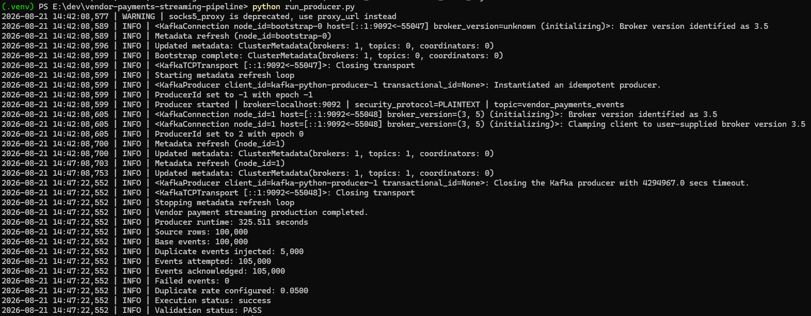
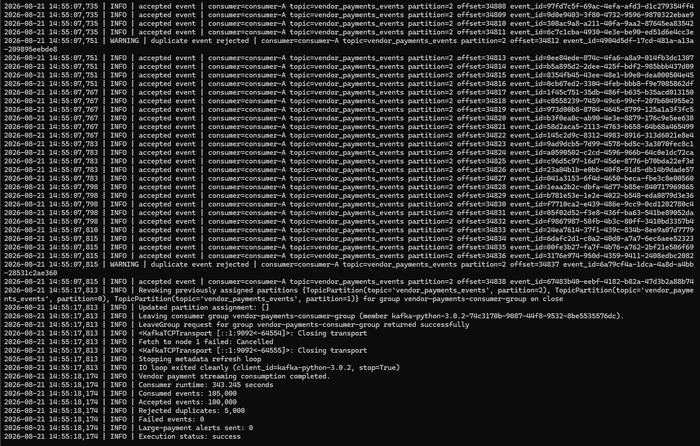
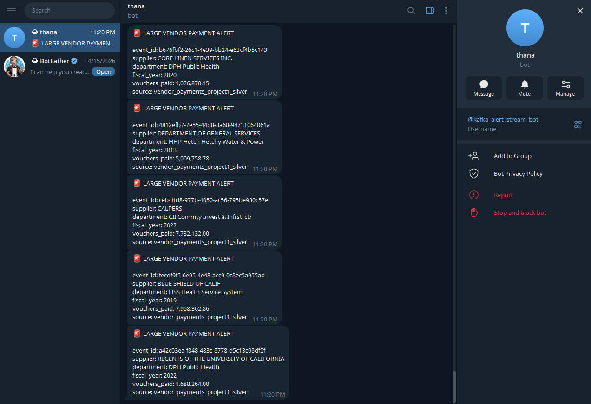
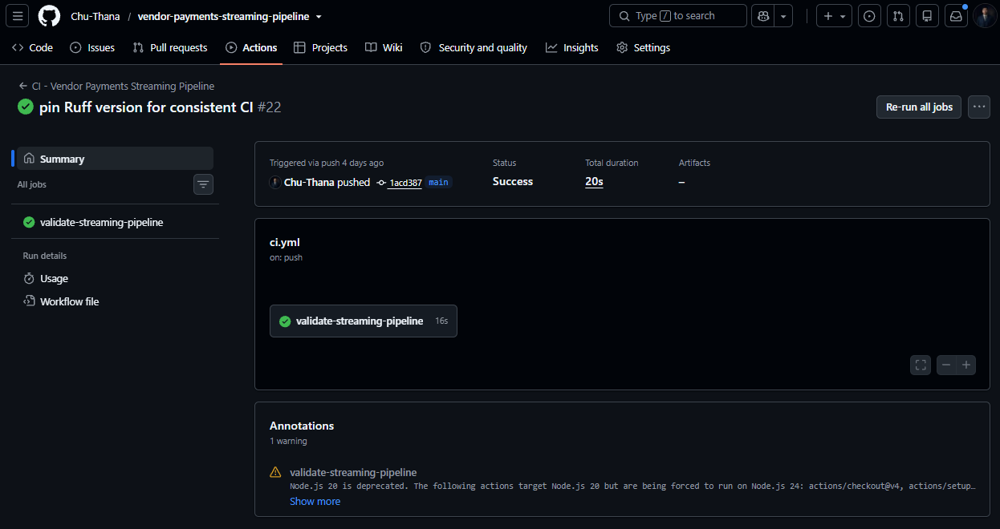

# ⚡ Vendor Payments Kafka Streaming Pipeline


Production-style Kafka streaming pipeline for converting cleaned Vendor Payments records into validated events, simulating retry and replay duplicates, applying Redis-based first-level deduplication, writing accepted events to staging, producing machine-readable runtime metadata, and optionally triggering Telegram alerts for high-value payments.

This repository is the streaming ingestion layer of the **Vendor Payments Data Engineering Portfolio**. Its validated staging output is consumed by downstream Airflow orchestration before cloud publishing, warehouse analytics, API serving, dashboards, and web analytics.

---

## 📌 Project Summary

The pipeline processes a deterministic simulated streaming workload built from **100,000 cleaned Vendor Payments records**.

It demonstrates:

* Streaming input preparation from trusted Silver data
* Structured event generation with preserved source payloads
* Kafka producer and consumer implementation
* Intentional duplicate injection for retry and replay simulation
* A 3-partition Kafka topic for partitioned event routing
* Redis event-ID deduplication before staging writes
* Manual Kafka offset commits for at-least-once processing
* Accepted, duplicate, failed, and alert metrics
* JSONL staging output for downstream processing
* Separate producer and consumer runtime metadata
* Event-balance and staging-count validation
* Optional Telegram large-payment alerting
* Automated testing, Ruff linting, Docker Compose, and GitHub Actions CI

The main reliability principle is:

```text
Prevent data loss first, then handle duplicates safely.
```

---

## 🧭 Architecture


The pipeline follows this workflow:

```text
Vendor Payments ETL Silver Sample
→ Prepare 100,000-Row Streaming Input
→ Build Structured Vendor Payment Events
→ Inject 5,000 Retry / Replay Duplicates
→ Publish 105,000 Events to a 3-Partition Kafka Topic
→ Consume and Validate Events
→ Redis First-Level Event-ID Deduplication
→ Accept 100,000 Unique Events / Reject 5,000 Duplicates
→ Write Validated Events to JSONL Staging
→ Generate Runtime Metadata and Validation Results
→ Optional Telegram Large-Payment Alerting
→ Airflow Downstream Validation and Second-Level Deduplication
→ S3 and Redshift Analytics
```

### Layer Responsibilities

* **Input Layer** — Uses a cleaned Silver-level Vendor Payments sample produced by the upstream ETL project
* **Event Builder** — Converts each source row into a structured Kafka event while preserving the full source payload
* **Kafka Producer** — Builds base events, injects deterministic duplicates, publishes events in bounded acknowledgement batches, and verifies delivery acknowledgements
* **Kafka Topic** — Routes the simulated 105,000-event workload across 3 partitions with replication factor 1 in the local portfolio environment
* **Kafka Consumer** — Polls Kafka, validates required fields, applies Redis deduplication, evaluates alerts, writes accepted events, and commits offsets manually
* **Redis First-Level Deduplication** — Rejects repeated `event_id` values before duplicate records reach staging
* **Streaming Staging Output** — Stores 100,000 accepted events in append-only JSONL format for downstream processing
* **Runtime Metadata** — Captures execution status, runtime, event counts, failures, output availability, and validation results
* **Airflow Downstream Processing** — Performs downstream validation and second-level record deduplication outside this repository's consumer execution
* **Monitoring and Alerting** — Produces structured execution reports and optional Telegram alerts for large payments

---

## 📊 Project Metrics

The following metrics were generated from the latest successful local portfolio execution.

| Metric | Value |
| --- | ---: |
| Source records loaded | 100,000 |
| Base events built | 100,000 |
| Duplicate events injected | 5,000 |
| Kafka events attempted | 105,000 |
| Kafka events acknowledged | 105,000 |
| Kafka events consumed | 105,000 |
| Unique events accepted | 100,000 |
| Redis duplicates rejected | 5,000 |
| Producer failed events | 0 |
| Consumer failed events | 0 |
| Staging records produced | 100,000 |
| Observed duplicate rate | 4.76% |
| Producer runtime | 325.511 seconds |
| Consumer runtime | 343.245 seconds |
| Producer throughput | ~323 events/second |
| Consumer throughput | ~306 events/second |
| Kafka partitions | 3 |
| Replication factor | 1 |
| Automated tests passed | 47 |
| Ruff linting | PASS |
| Producer validation | PASS |
| Consumer validation | PASS |
| Execution status | Success |

These figures represent a **local simulated streaming workload** for portfolio validation, not production traffic or a production benchmark. The successful validation run used a single consumer process; the three partitions prepare the topic for partitioned routing and future multi-consumer scaling.

---

## 🔎 Runtime Metadata

Producer and consumer run as separate processes and generate separate machine-readable execution summaries.

```text
output/reports/producer_execution_summary.json
output/reports/consumer_execution_summary.json
```

### Producer Metadata

Representative output from the latest successful execution:

```json
{
  "project": "Vendor Payments Kafka Streaming",
  "pipeline_version": "1.0.0",
  "execution_scope": "producer",
  "status": "success",
  "runtime_seconds": 325.511,
  "input": {
    "source_row_count": 100000,
    "available": true
  },
  "producer": {
    "base_event_count": 100000,
    "duplicate_events_injected": 5000,
    "events_attempted": 105000,
    "events_acknowledged": 105000,
    "failed_events": 0,
    "observed_duplicate_rate": 0.0476
  },
  "validation": {
    "status": "PASS"
  }
}
```

### Consumer Metadata

Representative output from the latest successful execution:

```json
{
  "project": "Vendor Payments Kafka Streaming",
  "pipeline_version": "1.0.0",
  "execution_scope": "consumer",
  "status": "success",
  "runtime_seconds": 343.245,
  "consumer": {
    "events_consumed": 105000,
    "accepted_events": 100000,
    "rejected_duplicates": 5000,
    "failed_events": 0,
    "large_payment_alerts_sent": 0
  },
  "outputs": {
    "staging": {
      "row_count": 100000,
      "available": true
    }
  },
  "validation": {
    "status": "PASS"
  }
}
```

The standard execution evidence was captured with Telegram alerting disabled, so `large_payment_alerts_sent` is `0`. A separate alert-enabled validation run is retained as Telegram evidence later in this README.

The metadata is generated from actual execution results rather than manually maintained values.

---

## 📂 Dataset

The streaming workload is prepared from cleaned Silver-level Vendor Payments data generated by the upstream ETL repository.

External Silver source:

```text
vendor-payments-etl-analytics
→ data/processed/silver/vendor_payments_silver_stream_sample_100k.csv
```

The preparation script copies the required deterministic sample into this repository as:

```text
data/input/vendor_payments_stream_sample.csv
```

The local streaming input contains:

```text
100,000 cleaned Vendor Payments records
```

Representative event fields include:

* `event_id`
* `event_type`
* `event_timestamp`
* `source_system`
* `source_row_hash`
* `business_composite_key`
* `fiscal_year`
* `supplier_name`
* `department`
* `payment_status`
* `vouchers_paid`
* `payment_amount`
* `payload`

The complete source row is retained inside `payload` so downstream consumers do not lose source-level detail.

---

## 🧱 Event Construction

The event builder converts each source row into a structured Vendor Payments event.

```text
common/event_builder.py
```

Responsibilities include:

* Required event-field validation
* Pandas and NumPy value normalization
* JSON-safe value conversion
* Top-level routing and business fields
* Full source payload preservation
* Deterministic event identity carried from the prepared input

Required event metadata:

```text
event_id
event_type
event_timestamp
source_system
```

---

## 📤 Kafka Producer

The producer implementation is located at:

```text
producer/producer.py
```

Processing flow:

```text
Read 100,000 source rows
→ Build 100,000 base events
→ Inject 5,000 deterministic duplicates
→ Shuffle the 105,000-event workload
→ Publish events in bounded acknowledgement batches
→ Wait for Kafka delivery acknowledgements
→ Generate producer execution metadata
```

The producer uses message keys in this order:

```text
business_composite_key
→ source_row_hash
→ event_id
```

Latest successful result:

```text
Source rows: 100,000
Base events: 100,000
Duplicate events injected: 5,000
Events attempted: 105,000
Events acknowledged: 105,000
Failed events: 0
Runtime: 325.511 seconds
Status: success
Validation: PASS
```



---

## 📨 Kafka Topic

The local Kafka topic is created through:

```text
scripts/create_topic.ps1
```

Current configuration:

```text
Topic: vendor_payments_events
Partition count: 3
Replication factor: 1
```

The three partitions allow Kafka to route keyed events across multiple partitions and provide room for future horizontal consumer scaling.

The current validation execution intentionally uses one consumer process:

```text
Partition 0 ─┐
Partition 1 ─┼─> consumer-A
Partition 2 ─┘
```

A single consumer can be assigned all three partitions. Multiple consumers in the same consumer group can later divide those partitions between processes, up to the partition count.


---

## 📥 Kafka Consumer

The consumer implementation is located at:

```text
consumer/consumer.py
```

Processing flow:

```text
Poll Kafka message
→ Validate required fields
→ Check event_id in Redis
→ Reject known duplicate or continue
→ Write accepted event to staging
→ Evaluate large-payment alert
→ Mark event as processed in Redis
→ Commit Kafka offset
→ Generate consumer execution metadata
```

The consumer disables automatic offset commits:

```python
enable_auto_commit = False
```

Offsets are committed only after an event is successfully handled or explicitly rejected as a known duplicate.

Latest successful result:

```text
Consumed events: 105,000
Accepted events: 100,000
Rejected duplicates: 5,000
Failed events: 0
Runtime: 343.245 seconds
Status: success
Validation: PASS
```



---

## ♻️ Deduplication Strategy

The complete Vendor Payments platform uses a two-layer deduplication design.

### Layer 1 — Redis Event-ID Deduplication

This repository performs first-level deduplication during Kafka consumption.

```text
common/dedup.py
```

Redis key format:

```text
event:{event_id}
```

The consumer checks whether the event ID is already present before writing to staging.

```text
New event_id
→ Write accepted event to staging
→ Evaluate optional alert
→ Store event_id in Redis with TTL
→ Commit Kafka offset

Existing event_id
→ Reject as duplicate
→ Commit Kafka offset
```

Latest Layer 1 result:

```text
Accepted unique events: 100,000
Rejected duplicate events: 5,000
Observed duplicate rate: 4.76%
```

### Layer 2 — Airflow Downstream Deduplication

A second deduplication layer is applied downstream through the Airflow orchestration repository.

This layer is intentionally excluded from the streaming consumer execution summary because it runs in a separate downstream stage.

```text
Layer 1: Redis event-level deduplication
Layer 2: Airflow downstream record-level deduplication
```

The two counts are not combined automatically because the layers execute at different stages and may evaluate different duplicate conditions.

---

## 🗃️ Streaming Staging Output

Accepted events are written to:

```text
output/staging/vendor_payments_streaming_staging.jsonl
```

Each accepted staging record includes:

```text
dedup_status
ingested_at
```

Latest output validation:

```text
Expected accepted events: 100,000
Actual staging records: 100,000
Status: PASS
```

The staging file is an append-oriented execution output, so a clean validation run resets the previous staging artifact before consuming a new workload.

---

## ✅ Validation

Runtime metadata validates both processing outcomes and output counts.

### Producer Validation

Producer checks:

```text
Source row count
=
Base event count
```

and:

```text
Events attempted
=
Events acknowledged
+ Failed events
```

Latest result:

```text
Input event count: PASS
Send outcome balance: PASS
Overall validation: PASS
```

### Consumer Validation

Consumer checks:

```text
Events consumed
=
Accepted events
+ Rejected duplicates
+ Failed events
```

Latest event balance:

```text
105,000
=
100,000
+ 5,000
+ 0
```

Consumer also validates:

```text
Accepted events
=
Staging record count
```

Latest staging balance:

```text
100,000
=
100,000
```

Latest result:

```text
Event balance: PASS
Staging record count: PASS
Overall validation: PASS
```

---

## 🚨 Telegram Large-Payment Alerting

The project can send Telegram alerts when:

```text
vouchers_paid >= 1,000,000
```

Alert fields include:

```text
event_id
supplier
department
fiscal_year
vouchers_paid
source
```

Alerting is controlled by environment variables and is disabled for normal validation and CI unless explicitly enabled.

```env
ENABLE_TELEGRAM_ALERTS=false
TELEGRAM_BOT_TOKEN=
TELEGRAM_CHAT_ID=
TELEGRAM_LARGE_PAYMENT_ALERT_LIMIT=5
```

A dedicated alert-enabled validation run successfully delivered five Telegram large-payment alerts.



Do not commit real Telegram credentials.

---

## 🖥️ Execution Evidence

### Streaming Infrastructure

Kafka, Redis, and Zookeeper run locally through Docker Compose. Redis connectivity is verified with `PING` / `PONG`.


### Kafka Topic

The topic is configured with 3 partitions and replication factor 1.


### Producer Execution

```text
Status: success
Events acknowledged: 105,000
Failed events: 0
Runtime: 325.511 seconds
Validation: PASS
```


### Consumer Execution

```text
Status: success
Events consumed: 105,000
Accepted events: 100,000
Rejected duplicates: 5,000
Failed events: 0
Runtime: 343.245 seconds
Validation: PASS
```


---

## 🧪 Automated Testing

The project includes tests for:

* Consumer required-field validation
* Consumer execution metrics
* Redis deduplication key generation
* Event construction
* Missing event-ID handling
* Large-payment threshold logic
* Alert message construction
* Duplicate injection
* Deterministic duplicate simulation
* Missing and valid source files
* Kafka acknowledgement success
* Send and acknowledgement failures
* Bounded acknowledgement batching
* Producer execution metadata
* Consumer execution metadata
* Event-balance validation
* Staging-count validation
* Producer input and send validation
* JSONL record counting
* Report file generation
* Project structure
* Staging writer output

Run tests:

```powershell
python -m pytest -v
```

Run code quality checks:

```powershell
python -m ruff check .
```

Current result:

```text
47 tests passed
Ruff passed
```


---

## ⚙️ Continuous Integration

GitHub Actions runs on pushes and pull requests.

The workflow validates:

```text
Repository checkout
→ Python environment setup
→ Dependency installation
→ Ruff linting
→ Pytest validation
→ Docker Compose configuration validation
```

Unit tests mock Kafka, Redis, and report-writing dependencies where appropriate, so CI does not require a live Kafka broker, Redis server, or Telegram bot.



---

## 🗂️ Project Structure

```text
vendor-payments-streaming-pipeline/
│
├── assets/
│   └── vendor-payments-streaming/
│       ├── 00_streaming_architecture.png
│       ├── 01_streaming_infrastructure.png
│       ├── 02_streaming_kafka_topic.png
│       ├── 03_streaming_tests_and_lint.png
│       ├── 04_producer_execution.png
│       ├── 05_consumer_execution.png
│       ├── 06_streaming_telegram_alert.png
│       └── 07_streaming_ci_success.png
│
├── common/
│   ├── alert_notifier.py
│   ├── config.py
│   ├── dedup.py
│   ├── event_builder.py
│   ├── large_payment_alert.py
│   ├── logging_config.py
│   ├── reporting.py
│   └── writer.py
│
├── consumer/
│   └── consumer.py
│
├── data/
│   └── input/
│       └── vendor_payments_stream_sample.csv
│
├── output/
│   ├── reports/
│   │   ├── producer_execution_summary.json
│   │   └── consumer_execution_summary.json
│   └── staging/
│       └── vendor_payments_streaming_staging.jsonl
│
├── producer/
│   └── producer.py
│
├── scripts/
│   ├── create_topic.ps1
│   ├── prepare_stream_sample.py
│   └── reset_streaming_execution.py
│
├── tests/
│   ├── test_consumer.py
│   ├── test_dedup.py
│   ├── test_event_builder.py
│   ├── test_large_payment_alert.py
│   ├── test_producer.py
│   ├── test_project_structure.py
│   ├── test_reporting.py
│   └── test_writer.py
│
├── .github/workflows/ci.yml
├── .env
├── .gitignore
├── docker-compose.yml
├── requirements.txt
├── run_consumer.py
├── run_producer.py
└── README.md
```

---

## ▶️ Run Locally

Create and activate a virtual environment:

```powershell
python -m venv .venv
.\.venv\Scripts\Activate.ps1
```

After activation, the PowerShell prompt should include `(.venv)` and the project can use the shorter `python ...` commands shown below.

Install dependencies:

```powershell
python -m pip install --upgrade pip
python -m pip install -r requirements.txt
```

### Start Kafka, Redis, and Zookeeper

```powershell
docker compose up -d
docker compose ps
```

Verify Redis:

```powershell
docker compose exec redis redis-cli ping
```

Expected result:

```text
PONG
```

### Create the Kafka Topic

```powershell
powershell -ExecutionPolicy Bypass -File scripts\create_topic.ps1
```

Expected topic configuration:

```text
Topic: vendor_payments_events
Partition count: 3
Replication factor: 1
```

Verify the topic:

```powershell
docker compose exec kafka kafka-topics `
  --bootstrap-server kafka:9092 `
  --describe `
  --topic vendor_payments_events
```

### Prepare the Streaming Input

```powershell
python scripts\prepare_stream_sample.py
```

Generated local input:

```text
data/input/vendor_payments_stream_sample.csv
```

### Reset a Previous Execution

The reset script removes the staging output, producer report, consumer report, and Redis keys matching `event:*`.

```powershell
python scripts\reset_streaming_execution.py
```

It intentionally does not use `FLUSHDB` or `FLUSHALL`.

The reset script does **not** delete Kafka topic records. For a fully clean local execution, recreate the Kafka topic before publishing a new workload.

Delete the existing topic:

```powershell
docker compose exec kafka kafka-topics `
  --bootstrap-server kafka:9092 `
  --delete `
  --topic vendor_payments_events
```

Recreate it:

```powershell
powershell -ExecutionPolicy Bypass -File scripts\create_topic.ps1
```

### Run the Producer

```powershell
python run_producer.py
```

Generated report:

```text
output/reports/producer_execution_summary.json
```

### Run the Consumer

Run the consumer after the producer has completed, or ensure both processes overlap for longer than the configured consumer timeout.

```powershell
python run_consumer.py consumer-A
```

A single consumer can read all three topic partitions during the local validation run.

Generated outputs:

```text
output/staging/vendor_payments_streaming_staging.jsonl
output/reports/consumer_execution_summary.json
```

### Run Tests and Ruff

```powershell
python -m pytest -v
python -m ruff check .
```

---

## 🔐 Environment Variables

Example local configuration:

```env
KAFKA_BROKER=localhost:9092
KAFKA_SECURITY_PROTOCOL=PLAINTEXT
KAFKA_SASL_MECHANISM=
KAFKA_USERNAME=
KAFKA_PASSWORD=

TOPIC_VENDOR_PAYMENTS=vendor_payments_events

REDIS_HOST=localhost
REDIS_PORT=6379
DEDUP_TTL_SECONDS=86400

VENDOR_PAYMENTS_ETL_SILVER_SAMPLE_FILE=E:\dev\vendor-payments-etl-analytics\data\processed\silver\vendor_payments_silver_stream_sample_100k.csv

STREAM_SAMPLE_FILE=data\input\vendor_payments_stream_sample.csv
STAGING_FILE=output\staging\vendor_payments_streaming_staging.jsonl
PRODUCER_EXECUTION_REPORT_FILE=output\reports\producer_execution_summary.json
STREAMING_SUMMARY_REPORT_FILE=output\reports\consumer_execution_summary.json

STREAM_SAMPLE_SIZE=100000
DUPLICATE_RATE=0.05
RANDOM_SEED=42

LARGE_PAYMENT_THRESHOLD=1000000
TELEGRAM_LARGE_PAYMENT_ALERT_LIMIT=5

LOG_LEVEL=INFO
KAFKA_LOG_LEVEL=WARNING
REDIS_LOG_LEVEL=WARNING

ENABLE_TELEGRAM_ALERTS=false
TELEGRAM_BOT_TOKEN=
TELEGRAM_CHAT_ID=
```

Do not commit real credentials or secrets.

---

## 🧠 Key Engineering Decisions

### Why simulate duplicate events?

Retry, replay, consumer restarts, and at-least-once delivery can cause the same logical event to arrive more than once.

Injecting duplicates creates a deterministic workload for verifying deduplication behavior instead of relying on accidental failures.

### Why use Redis for first-level deduplication?

Redis provides fast key lookup and configurable TTL support.

It allows the consumer to reject repeated `event_id` values before writing duplicate records to staging.

### Why write staging before marking Redis?

The consumer writes the accepted event to staging before storing its deduplication key in Redis.

This ordering reduces the risk of recording an event as processed when its staging write did not succeed.

### Why commit offsets manually?

Automatic commits may advance Kafka offsets before application processing is complete.

Manual commits make the processing boundary explicit and support the at-least-once design.

### Why avoid claiming exactly-once processing?

Exactly-once behavior requires guarantees across transport, processing state, and output systems.

This project instead makes its reliability boundary explicit:

```text
Prevent data loss first
→ Accept at-least-once delivery
→ Detect and reject duplicates
→ Validate downstream outputs
```

### Why use two deduplication layers?

The Redis layer protects the streaming ingestion stage from repeated event IDs.

The Airflow layer performs downstream record-level validation and second-level deduplication before analytics consumption.

### Why use bounded acknowledgement batches?

Waiting until all 105,000 sends were queued caused local Kafka delivery timeouts.

The producer now resolves delivery acknowledgements in bounded batches, reducing pending futures and preventing the local producer buffer from growing without control.

### Why use three Kafka partitions?

Three partitions demonstrate partitioned event routing and make the topic ready for future horizontal consumer scaling.

The current validation run still uses one consumer process, so this README does not claim a three-consumer throughput benchmark. A future multi-consumer test can measure how throughput changes when partitions are distributed across multiple consumer processes.

### Why generate separate producer and consumer metadata?

Producer and consumer run as separate processes and measure different execution scopes.

Separate reports avoid implying that their runtimes represent one orchestrated end-to-end execution.

### Why generate runtime metadata?

Terminal logs are useful for people but difficult for downstream systems to consume.

The JSON summaries convert event counts, delivery results, output counts, runtime, validation, and status into structured, verifiable evidence.

---

## 🔗 Role in the Vendor Payments Data Platform

```text
Vendor Payments ETL Foundation
        ↓
Kafka Streaming Pipeline
        ↓
Airflow Orchestration
        ↓
AWS S3 + Redshift Analytics
        ↓
FastAPI Serving
        ↓
Power BI + React Analytics
```

This streaming repository provides:

* Real-time-style event ingestion
* Retry and replay simulation
* First-level Redis deduplication
* Optional large-payment operational alerts
* Validated streaming staging output
* Runtime metadata for execution evidence
* Input for downstream Airflow validation and second-level deduplication
* Streaming data that can be published to S3 and loaded into Redshift
* Downstream data that can be exposed through APIs, dashboards, and web analytics

---

## 🛣️ Planned Development

The current portfolio version is intentionally bounded and reproducible. Possible production-oriented extensions include:

* Cloud-backed Kafka configuration
* Centralized producer and consumer observability
* Historical execution metadata storage
* Consumer lag monitoring
* Dead-letter topic handling
* Schema registry integration
* Multi-consumer scaling and throughput tuning
* Stronger delivery and state guarantees across Kafka, Redis, and downstream storage

---

## 🎯 Key Takeaway

This project is more than a Kafka producer and consumer demonstration.

It shows how a production-style streaming ingestion layer can simulate retry and replay conditions, verify Kafka delivery outcomes, route events across partitions, apply event-level deduplication, preserve accepted events in staging, trigger optional operational alerts, validate execution balances, and generate machine-readable runtime evidence for downstream orchestration.

```text
Trusted Silver Input
→ Kafka Event Stream
→ Redis Deduplication
→ Validated Staging Output
→ Airflow Downstream Processing
→ Cloud Analytics and Serving
```
